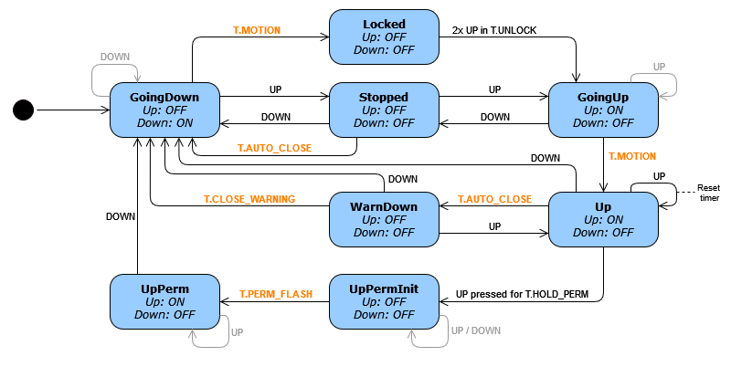

# Garage door 3.0

This repository contains the Shelly 2PM script I use to control the door of my garage.

## Background

The door of my garage is a bit special in that it uses standard roller shutters instead of a specialized 
garage door system. The door can be operated using up / down buttons inside the garage and 2-button wireless controllers.

Version 2.0 worked quite simple: pressing the "up" button inside the garage or on a remote controller would open the door.
Pressing a "down" button closed the door again.

While this worked well, the garage would sometimes open by accident because we're carrying the wireless controllers with our keys and they would get triggered in our pockets. We wouldn't always notice and the door would be open for hours / over night. As we're storing our bikes in the garage, 
that's a big issue.

Ideally, I wanted to have the following additional features for the garage door:
- Only open when the "up" key is double-pressed (to prevent accitental activations).
- Auto-close after a couple of minutes. 
- Warn 10s before closing the door by turning off the lights in the garage.
- While the garage is open: press "up" again to reset the auto-close timer.
- While the garage is open: press and hold "up" for 2 seconds to make the door open permanently (until "down" is pressed).

## Solution

I've replaced the simple roller shutter controller with a Shelly 2PM. This device is scriptable and allowed me to implement the functionality listed above. 

The following state machine shows the behavior I implemented:

*Note: The "Up" channel is also connected to the lights*

The actual implementation can be found in the  [`garage_door.js`](garage_door.js) file.

## Contribution

Feel free to suggest improvements or open issues if you have questions.